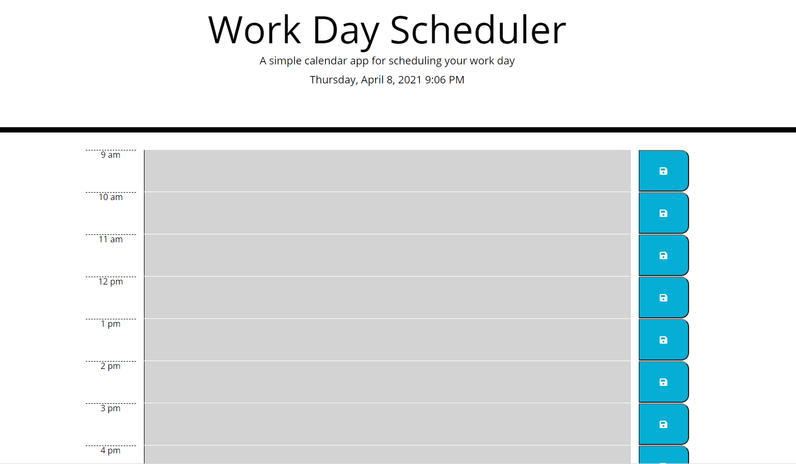

### Work Day Scheduler
---
## Summary of Criteria

Assigment was to create a calendar application that will: 

* use Moment API to place current date and time in the header of the website.

* have a dedicated timeblocks for each hour of the work day for user entries.

* allows for user to enter a task into the timeblocks which upon clicking a button, will save to local storage as well as successfully pull from local storage when sit is refreshed.

* use Moment to dynamically color code each timeblock to indicate which hour of the day is current. 

--- 

## Summary of Experience

-I felt that I found some success with being able to script jquery as well as creating elements in html from my js.

-Main trouble was saving the information to local storage as well as having that information pulling saved events upon refresh. Had help from a couple tutor sessions and instructor guidance as well as hours of looking at documentation. 

# Links to active site and repo below:

[Work Day Scheduler Active Link](https://mjpagenkopf.github.io/work_day_scheduler/)

[Work Day Scheduler Repository Link](https://github.com/mjpagenkopf/work_day_scheduler)

